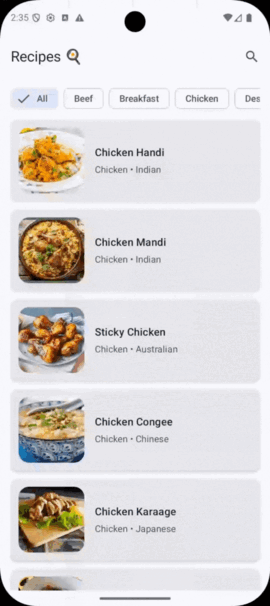

# Recipe Viewer 🍳

A modern **Kotlin Multiplatform** + **Compose Multiplatform** recipe browser using TheMealDB API.

Runs on **Android**, **iOS**, **Desktop (JVM)**, and **Web (WASM)** with shared business logic & UI.

### Features
- Browse recipes by category or search
- View full recipe details (ingredients, instructions, video link)
- Pull-to-refresh + shimmer loading
- Real-time search with debounce
- Light/Dark theme (system + Material You dynamic colors on Android)
- Accessibility: content descriptions, large text support, touch targets
- Clean architecture (Repository + ViewModel + Result pattern)

### Tech Stack
| Category              | Technologies                                                                |
|-----------------------|-----------------------------------------------------------------------------|
| Language              | Kotlin 2.3.0                                                                |
| UI                    | Compose Multiplatform 1.9+ (Material3)                                      |
| Networking            | Ktor Client + kotlinx-serialization                                         |
| Storage               | AndroidX DataStore (Preferences)                                            |
| Navigation            | Voyager (tabs + screen navigator)                                           |
| Image Loading         | Coil-Compose (with placeholders, errors, caching)                                  |
| Architecture          | MVVM + Repository pattern + clean multiplatform separation                  |
| Platforms             | Android • iOS • Desktop (JVM) • Web (WASM – optional)                       |

### Screenshots & Demo

**Light / Dark mode**


**Search + Category filtering**



### Architecture Overview


### License
MIT License

### Contributing
Feel free to open issues or PRs!
Made with ❤️ using Kotlin Multiplatform

### Build & Run

```bash
# Android
./gradlew androidApp:installDebug

# Desktop (JVM)
./gradlew composeApp:run

# iOS (macOS only)
./gradlew :composeApp:iosSimulatorArm64Run

# Check all targets
./gradlew check
